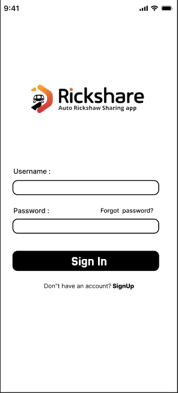
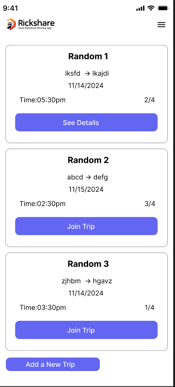
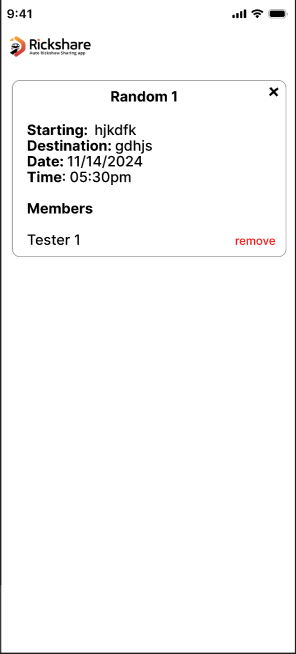
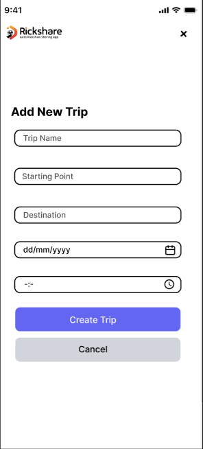
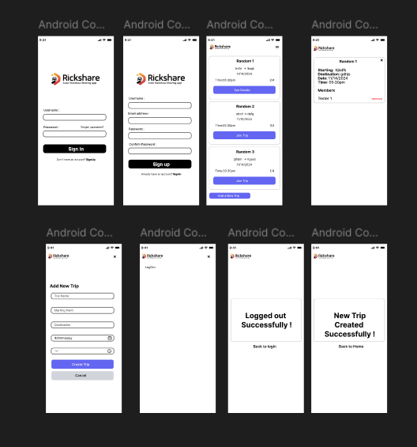
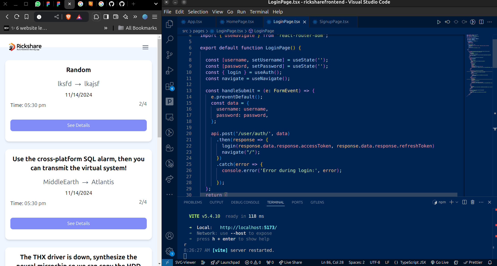
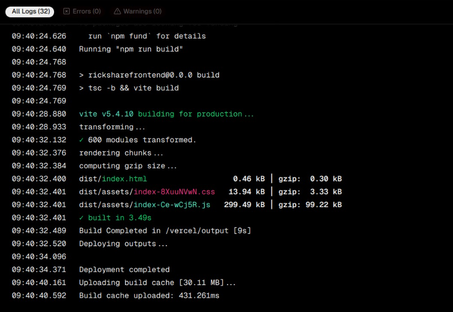
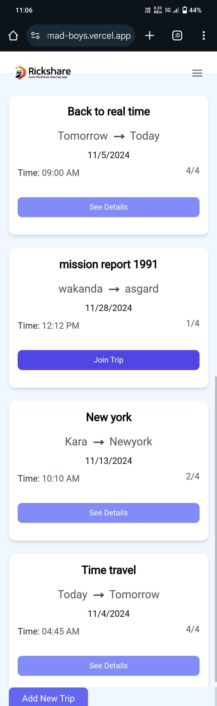
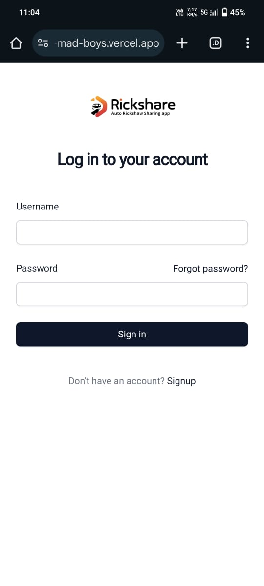

# 🛺 RICKSHARE

## Basic Details

### Team Name: Mad Boys

### Team Members

- Team Lead: Dilshad Mohammed - NSS College of Engineering, Palakkad
- Member 2: Noel Tom Santhosh - NSS College of Engineering, Palakkad
- Member 3: Harikrishnan A - NSS College of Engineering, Palakkad

### Project Description

Our project aims to create a rickshaw-sharing platform that connects individuals traveling to the same destination at similar times, allowing them to team up and share a rickshaw. This solution not only reduces individual travel expenses but also contributes to minimizing traffic congestion and carbon emissions. Our platform allows individuals to create a "travel card" with their destination, time, and other relevant details. Other users with similar travel plans can then view and join these cards, forming teams to share a rickshaw. This initiative represents a step towards making urban transportation more affordable, sustainable, and accessible.
> This idea originated from our experiences teaming up with strange students during our morning commutes to college from nearby town, fostering unexpected friendships along the way.

### The Problem (that doesn't exist)

Ever feel overwhelmed by the hassle of solo rickshaw rides to common destinations? Are you constantly burdened by the soul-crushing existential dread of... not having anyone to split the fare with on your five-minute journey? Well, you’re not alone (except, you know, you usually are in the rickshaw). Urban transportation has become a lonely affair, and it’s high time we put an end to this tragic solo-commuting lifestyle. After all, why have an uneventful, private ride when you could embark on a thrilling rickshaw adventure with a complete stranger? Yes, that’s the real transportation crisis no one is talking about.

### The Solution (that nobody asked for)

Introducing Rickshare—the platform that brings people together to plan their rickshaw adventures, leaving the actual rickshaw-hailing to your expert skills. Here’s how it works: you enter your destination, time, and any fun facts (such as "Will only sit on the left side" or "Brings own background music"), and Rickshare will match you with other eco-conscious adventurers heading the same way.Rickshare handles the logistics of making friends with strangers. Sustainable transport, social connections, and the thrill of the chase—Rickshare: the ultimate way to almost make rickshaw-sharing easy.

## Technical Details

### Technologies/Components Used

#### UI/UX

- Figma

#### Frontend

- HTML, CSS, Typescript
- React, Tailwind

#### Backend

- Python
- Django REST Framework

### Implementation

Built the Frontend using React

# Installation

##### 1. clone the repository

##### 2. For Frontend

> cd ricksharefrontend
> npm install

##### 3. For Backend

> cd ricksharebackend
> python -m venv venv
> source venv/bin/activate
> pip install -r requirements.txt

# Run

##### 1. For Frontend

> npm run dev

##### 2. For Backend

> python manage.py makemigrations
> python manage.py migrate
> python manage.py runserver

### Project Documentation

For Software:

# Screenshots (UI)

User can login/signup to rickshare.

Users can view availabe trips, join a trip or create a trip

Can view details of a trip

Create trip.

# Build Photos

Figma Frames of the website created

> - Signup
> - Login
> - Home page
> - View trip
> - Create trip
> - Trip acknowledgements
> - logout

Frontend for the website developed

deployment done in vercel

### Project Demo

# Video

https://www.youtube.com/watch?v=t2wz8Wjk8Xs

<!-- # Additional Demos

[Add any extra demo materials/links] -->

## Team Contributions

- Dilshad Mohammed: [Backend, Frontend]
- Noel Tom Santhosh: [Frontend]
- Harikrishnan A: [UI/UX, Frontend]

---

Made with ❤️ at TinkerHub Useless Projects

